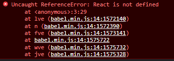
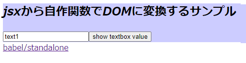
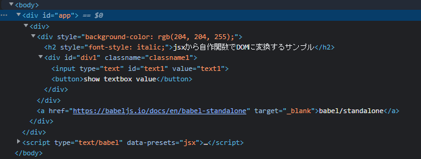
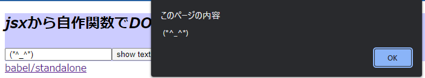
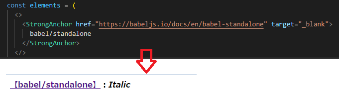

# JSXを利用したDOM生成ライブラリの作成方法(パート1)

この記事はJSXのみを利用したDOM生成のやり方を解説します

パート1：babelを利用し単一htmlファイル内で最低限の動作確認を行う

パート2：TypeScriptを使いjsxの型定義を行う

## はじめに

便利ですよねJSX。ReactやVueを使えばライブラリ側がDOMを生成して表示してくれます。

こんなに便利なのに、古いWebアプリ(jQuery等)と一緒に使われている所を見たことがありません。

なぜなら、ReactやVueを使わずに独自でDOM生成を行うライブラリを見かけないためだと考えました。

そこで、JSXのみ(ライブラリ未使用)でDOMを生成する方法を考えてみます(jQueryと組み合わて使うことはできます)

※TypeScriptを使えば、属性(型)のチェックも同時に行うことができますが、複雑になるためこの記事では扱いません。パート2で記載する予定

* やりたいことは下記のように、文字列で追加するのをやめて、jsxで追加することです
```javascript
// jQueryで追加する場合
 $('#app').append('<p><strong>要素の追加テストです。</strong></p>');
```

```javascript
// jsxで追加する場合
 $('#app').append(<p><strong>要素の追加テストです。</strong></p>);
```


### 確認の手順
* 単一のhtmlファイルのみで動くようにするため[babel/standalone](https://babeljs.io/docs/en/babel-standalone)を利用してトランスパイルを行います
* jsxがどのように変換されるか(関数呼び出しに変換される)確認します
* DOMを生成する関数を定義して「`要素の追加テストです。`」が太字で表示されることを確認します

※`babel/standalone`は、ブラウザ内でトランスパイルを行うことができるライブラリ

簡単な使い方は[babel/standaloneの使い方(文字列に格納したjavascriptソースをブラウザ内でトランスパイルする)](https://qiita.com/murasuke/items/8dbe350c0c1c1fe269bf)をご確認ください

https://qiita.com/murasuke/items/8dbe350c0c1c1fe269bf


## ①準備

JSXがどのように変換されるかを確認します。

通常、jsxをトランスパイルするためには[babel](https://babeljs.io/)や[TypeScript](https://www.typescriptlang.org/)を利用しますが、
トランスパイル＋実行の手順が少々面倒です。

そこで[babel/standalone](https://babeljs.io/docs/en/babel-standalone)を利用して1つのHTMLファイルのみで実行できるようにします。

* webサーバー不要(htmlファイルをダブルクリックするだけで実行可能))
* TypeScriptやtsxも実行できる(オプション次第)


### テンプレートhtml (DOM生成関数がないため、エラーになります。この後追加)
```html
<!DOCTYPE html>
<head>
  <meta charset="utf-8">
  <title>babel/standaloneでjsxをトランスパイルするテンプレート</title>
  <script src="https://unpkg.com/@babel/standalone/babel.min.js"></script>
  <script>
    // babelでjsxをトランスパイル可能にするため、プライグイン[transform-react-jsx]を
    // 読み込んだプリセット「jsx」を登録します
    Babel.registerPreset('jsx', {
      presets: [
        [Babel.availablePresets['env']]
      ],
      plugins: [
          [Babel.availablePlugins['transform-react-jsx']]
      ],
    });
  </script>

</head>
<body>
  <div id="app"></div>
  <!--
    type="text/babel" ⇒ babelにトランスパイル対象であることを伝える(ブラウザからは無視されます)
    data-presets="jsx" ⇒ 上記で登録したプリセットでトランスパイルします
   -->
  <script type="text/babel" data-presets="jsx" >
    const elements = <p><strong>要素の追加テストです。</strong></p>;
    document.getElementById('app').appendChild(elements);
  </script>
</body>
</html>

```

※テンプレート.htmlを実行すると実行時エラーが発生します（`React is not defined`）

　⇒DOM生成関数が未定義のため。JSXが`React.createElement()`という関数に変換されるためです



変換後ソースのイメージ
```javascript
var elements = /*#__PURE__*/React.createElement("p", null,
            /*#__PURE__*/React.createElement("strong", null, "要素の追加テストです。")
            );
```

`React.createElement()`という関数名を定義しても良いですが、Reactを使うわけではないのでbableの設定を変更して、別の関数名(`h()`)に変更し、その関数を定義していきます


## ②DOM生成関数を定義して、実行エラーを解消する
②ではbabelの設定を変更して自作のDOM生成関数を呼び出すようにしてみます

 1. Babelの設定を変更して、jsx変換後の関数を`h()`にする
 1. DOMを生成する関数`h(tagName, props,  ...children)`を作る
 1. jsxからDOMオブジェクトが生成されることを確認する
 1. (おまけ)独自コンポーネントを生成できるように`h()`関数を修正する


### ②-1 babelの設定を変更して、jsx変換後の関数を`h()`にする

jsxをbabelでトランスパイルすると、標準では`React.createElement()`の呼び出しに変換されます。
  ⇒ 今回はReactを使わないため、自分で定義した関数を呼び出すように設定を変更します

設定変更箇所(一部抜粋)
```html
  <script src="https://unpkg.com/@babel/standalone/babel.min.js"></script>
  <script>
    Babel.registerPreset('jsx', {
      presets: [
        [Babel.availablePresets['env']]
      ],
      plugins: [
          [
            Babel.availablePlugins['transform-react-jsx'],
            {pragma:'h', pragmaFrag: '"div"'},　　// 追加
          ]
      ],
    });
  </script>
```
* `pragma:'h'`：jsxを変換した後の`関数名`を`h()`に変更
* `pragmaFrag: 'div'` ：jsxフラグメント`<> </>`を`<div>`に置き換える


設定変更により、babelでトランスパイルした結果が以下のように変わります

jsx変換前のソース
```javascript
const element = <p><strong>要素の追加テストです。</strong></p>;
```

jsx変換後(babelのデフォルト設定。jsxが`React.createElement()`に変換される)
```javascript
var element = /*#__PURE__*/React.createElement("p", null,
            /*#__PURE__*/React.createElement("strong", null, "要素の追加テストです。")
            );
```

変換後(babel設定変更後。`h()`関数の置き換わりました)
```javascript
var element = /*#__PURE__*/h("p", null,
            /*#__PURE__*/h("strong", null, "要素の追加テストです。")
            );
```


### ②-2 DOMを生成する関数`h(tagName, props,  ...children)`を作る

jsxが関数`h()`を呼び出すようになったので、次はDOMオブジェクトを生成する関数を作成します。

こんなイメージです。
```javascript
function h(tag, props, ...children) {
  // elementを作成
  const elm = document.createElement(tag);
　/* 属性や子要素の追加を追加する。詳細は省略*/
  return elm;
}
```


引数は順に(`タグ名`, `属性`, `子要素`)です。使い方は下記のようなイメージになります。
```js
h('div',{id: 'divid'}, 'text')
//<div id="divid">text</div>
```

作成する関数の仕様について

  * DOMに変換する関数の仕様（[React.createElement()](https://beta.reactjs.org/reference/react/createElement)とほぼ同じ仕様です

* 関数定義  h(tag, props, ...children)
  * tag: タグ名(コンポーネントの場合はfunctionオブジェクト)
  * props: タグの属性(ex. {id: 'divid'})
  * children: 子要素(文字列、もしくは子タグ)
  * 戻り値: DOMオブジェクト

tagについて（※独自コンポーネントのサポートは後で行う。ここでは文字列の場合のみ）
  * タグの先頭が大文字で始まる場合、引数にfunctionオブジェクトが渡される。独自コンポーネントを生成するための関数なのでそのまま呼び出す。タグ名が文字列の場合は、DOMを生成して返す。
```jsx
// 独自コンポーネント
<CustomComponent />
// ↓のように変換される
var elements = /*#__PURE__*/React.createElement(CustomComponent, null, "text");
```

propsについて
  * styleやイベント関数も指定できることを考慮する
```js
h('div',{style: {backgroundColor: 'red'}, onclick={() => alert('test')}}, 'text')
```


仕様を踏まえて、DOM生成関数を作ります
```javascript
function h(tag, props, ...children) {
  // elementを作成
  const elm = document.createElement(tag);
  // 属性を追加
  for (const prop in props) {
    if (prop === 'style') {
      // styleの追加
      for (const s in props[prop]) {
        elm.style[s] = props[prop][s];
      }
    } else if (/^on\w+/.test(prop)) {
      // イベントハンドラの追加
      elm.addEventListener(prop.substring(2), props[prop], false);
    } else {
      // 上記以外の属性を追加
      elm.setAttribute(prop, props[prop]);
    }
  }

  // 子要素の追加
  if (Array.isArray(children)) {
    // 入れ子の配列を平坦化
    const flatten = children.flat(20);
    for (const child of flatten) {
      if (typeof child === 'object') {
        // Nodeをそのまま追加(先に子側が生成され、それが渡される)
        elm.appendChild(child);
      } else {
        // 文字列の場合、TextNodeを追加
        elm.appendChild(document.createTextNode(child));
      }
    }
  }
  return elm;
}
```

変換サンプル
``` html
・h('div')
   ⇒ <div></div>
・h('div',null, 'text')
   ⇒ <div>text</div>
・h('div',{id: 'divid'}, 'text')
   ⇒ <div id="divid">text</div>
・h('div',{style: {backgroundColor: 'red'}}, 'text')
   ⇒ <div style="background-color: red;">text</div>
・h('div',{style: {'background-color': 'red'}}, 'text', h('span', {}, 'span tag'))
   ⇒ <div style="background-color: red;">text<span>span tag</span></div>
```

### ②-3 jsxからDOMを生成(動作確認)

下記[ソース(step2-3.html)](./step2-3.html)をブラウザで開くと、jsxからDOMに変換されて表示されます。




* ブラウザのDevToolで、DOMが想定した通りに生成(属性やstyle)されていることが確認できました


* ボタンのclickイベント(テキストボックスに入力した内容をalert()で表示)も動作しています


ソース全体(step2-3.html)
```html
<!DOCTYPE html>
<head>
  <meta charset="utf-8">
  <title>jsxを自力でDOM化してみよう</title>
  <script src="https://unpkg.com/@babel/standalone/babel.min.js"></script>
  <script>
    Babel.registerPreset('jsx', {
      presets: [
        [Babel.availablePresets['env']]
      ],
      plugins: [
          [
            Babel.availablePlugins['transform-react-jsx'],
            {pragma:'h', pragmaFrag: '"div"'},
          ]
      ],
    });
  </script>
  <script>
    /**
     * DOMに変換する関数
     * ・React.createElement()や、hyperscript()のようにDOMを生成する関数
     *   tag: タグ名
     *   props: タグの属性
     *   children: 子要素
     * 変換サンプル
     * ・h('div')
     *    ⇒ <div></div>
     * ・h('div',null, 'text')
     *    ⇒ <div>text</div>
     */
     function h(tag, props, ...children) {
      // elementを作成
      const elm = document.createElement(tag);
      // 属性を追加
      for (const prop in props) {
        if (prop === 'style') {
          // styleの追加
          for (const s in props[prop]) {
            elm.style[s] = props[prop][s];
          }
        } else if (/^on\w+/.test(prop)) {
          // イベントハンドラの追加
          elm.addEventListener(prop.substring(2), props[prop], false);
        } else {
          // 上記以外の属性を追加
          elm.setAttribute(prop, props[prop]);
        }
      }

      // 子要素の追加
      if (Array.isArray(children)) {
        flatten = children.flat();
        for (const child of flatten) {
          if (typeof child === 'string') {
            // 文字列の場合、TextNodeを追加
            elm.appendChild(document.createTextNode(child));
          } else {
            // 上記以外はNodeをそのまま追加(先に子側が生成され、それが渡される)
            elm.appendChild(child);
          }
        }
      }
      return elm;
    }
  </script>
</head>
<body>
  <div id="app"></div>
  <script type="text/babel" data-presets="jsx" >
    const elements = (
      <>
        <div style={{ backgroundColor: '#ccf' }}>
          <h2 style={{"font-style":"italic"}}>jsxから自作関数でDOMに変換するサンプル</h2>
          <div id="div1" className="classname1">
            <input type="text" id="text1" value="text1" />
            <button onclick={() => alert(document.getElementById('text1').value)}>
              show textbox value
            </button>
          </div>
        </div>
        <a href="https://babeljs.io/docs/en/babel-standalone" target="_blank">
          babel/standalone
        </a>
      </>
    );
    document.getElementById('app').appendChild(elements);
  </script>
</body>
</html>
```


### ③ 独自コンポーネント(大文字のタグ)を定義できるようにする
jsxでは独自タグ(コンポーネント)を作ることができます。

* 大文字で始まるタグが同名の関数呼び出しに変換される
```jsx
  var elements = <StrongAnchor href="https://npm.im/hyperscript" target="_blank">
    open hyperscript page
  </StrongAnchor>
```

トランスパイル後 (`h()`の引数として、`StrongAnchor`という関数が渡されるようになる)
```javascript
var elements = h(StrongAnchor, {
  href: "https://babeljs.io/docs/en/babel-standalone",
  target: "_blank"
}, "babel/standalone");
```
上記の変換後コードを動かすために、下記の変更を行います
1. (大文字で始まる)タグ名と同じ関数を定義する
1. 関数が`h()`に引き渡された場合、その関数を呼び出す


#### ③-1. (大文字で始まる)タグ名と同じ名前の関数を定義する(DOMオブジェクトを返す)

* 関数の引数は(`props`, `...childlen`)で定義する(タグ名は不要)
* コンポーネントを入れ子にすることもできる

```javascript
    function Strong(props, ...children) {
      return <strong {...props}>{children}</strong>;
    }
    function StrongAnchor(props, ...children) {
      return (
        <Strong>
          <a {...props}>
            【{children}】
          </a>
          ：
          <span style={{"font-style":"italic"}}>Italic</span>
        </Strong>
      );
    }
```

#### ③-2. 関数が`h()`に引き渡された場合、その関数を呼び出すように変更する

tagが関数の場合は、その関数を呼び出す処理を追加します

```javascript
  function h(tag, props, ...children) {
    // ↓ 追加開始
    if (typeof tag === 'function') {
      // 先頭が大文字のタグは関数に変換されるためそのまま呼び出す
      return tag(props, children);
    }
    // ↑ 追加終了

    // ↓以下同じなので省略


    // 子要素の追加
    if (Array.isArray(children)) {
      flatten = children.flat(20); // 追加、入れ子の配列になるので1次元に変換
      for (const child of flatten) {
    // ↓以下同じなので省略
```

* 画面イメージ(step3-1.html)

  &lt;StrongAnchor&gt;が(【】で囲われた太字のリンク＋Itaricの文字)に変換されました。



ソース全体(step3-1.html)
```html
<<!DOCTYPE html>
<head>
  <meta charset="utf-8">
  <title>jsxから自作関数でDOMに変換するサンプル(独自コンポーネント追加)</title>
  <script src="https://unpkg.com/@babel/standalone/babel.min.js"></script>
  <script>
    Babel.registerPreset('jsx', {
      presets: [
        [Babel.availablePresets['env']]
      ],
      plugins: [
          [
            Babel.availablePlugins['transform-react-jsx'],
            {pragma:'h', pragmaFrag: '"div"'},
          ]
      ],
    });
  </script>
  <script>
    /**
     * DOMに変換する関数
     * ・React.createElement()や、hyperscript()のようにDOMを生成する関数
     *   tag: タグ名
     *   props: タグの属性
     *   children: 子要素
     * 変換サンプル
     * ・h('div')
     *    ⇒ <div></div>
     * ・h('div',null, 'text')
     *    ⇒ <div>text</div>
     */
     function h(tag, props, ...children) {
      if (typeof tag === 'function') {
        // 先頭が大文字のタグは関数に変換されるためそのまま呼び出す
        return tag(props, children);
      }

      // elementを作成
      const elm = document.createElement(tag);
      // 属性を追加
      for (const prop in props) {
        if (prop === 'style') {
          // styleの追加
          for (const s in props[prop]) {
            elm.style[s] = props[prop][s];
          }
        } else if (/^on\w+/.test(prop)) {
          // イベントハンドラの追加
          elm.addEventListener(prop.substring(2), props[prop], false);
        } else {
          // 上記以外の属性を追加
          elm.setAttribute(prop, props[prop]);
        }
      }

      // 子要素の追加
      if (Array.isArray(children)) {
        // 入れ子の配列を平坦化
        const flatten = children.flat(20);
        for (const child of flatten) {
          if (typeof child === 'object') {
            // Nodeをそのまま追加(先に子側が生成され、それが渡される)
            elm.appendChild(child);
          } else {
            // 文字列の場合、TextNodeを追加
            elm.appendChild(document.createTextNode(child));
          }
        }
      }
      return elm;
    }
  </script>
</head>
<body>
  <div id="app"></div>
  <script type="text/babel" data-presets="jsx" >
    function Strong(props, ...children) {
      return <strong {...props}>{children}</strong>;
    }
    function StrongAnchor(props, ...children) {
      return (
        <Strong>
          <a {...props}>
            【{children}】
          </a>
          ：
          <span style={{"font-style":"italic"}}>Italic</span>
        </Strong>
      );
    }

    const elements = (
      <>
        <StrongAnchor href="https://babeljs.io/docs/en/babel-standalone" target="_blank">
          babel/standalone
        </StrongAnchor>
      </>
    );

    document.getElementById('app').appendChild(elements);
  </script>
</body>
</html>
```

